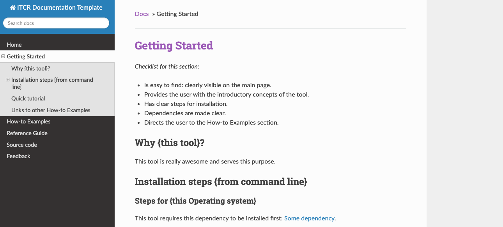

# Documentation and Usability Course

This is a bookdown based course to cover the basics of creating documentation and tutorials to maximize the usability of ITCR tools.

This course is a part of an [ITCR training series](https://www.itcrtraining.org/) and was in part created from [this github template](https://github.com/jhudsl/DaSL_Course_Template_Bookdown).

You can see the [rendered course material here](https://jhudatascience.org/Documentation_and_Usability/introduction.html) or [on Leanpub here](https://leanpub.com/universities/courses/jhu/documentation_and_usability).

This course guides you on how to make a nice documentation website using [this handy template](https://github.com/jhudsl/template-documentation) and its associated checklists!

Here's a preview of what that looks like

If you would like to contribute to this course material, take a look at the [CONTRIBUTING.md](./CONTRIBUTING.md) to get started and/or contact us on the [ITCR training website](https://www.itcrtraining.org/join-us).

## About this course

Informatics tools are designed to be used by a broad audience, everyone from entry level graduate students in biology to working professionals. Designing good user experiences can help increase usability of tools, but even for tools with necessarily complicated user interfaces, good documentation and tutorials can have an outsized impact on use and usability. This course is designed to teach principles of documentation and tutorials to tool developers in the ITCR and beyond.

## Learning Objectives

This course will demonstrate how to:

- Understand why usability and documentation is vital.
- Identify your user community.
- Build documentation and tutorials to maximize the usability of developed tools.
- Obtain feedback from your users.

## Encountering problems?

If you are encountering any problems with this course, please file a GitHub issue or fill out [this feedback form](https://forms.gle/bQHH3jPjMUj3gmcN7).
