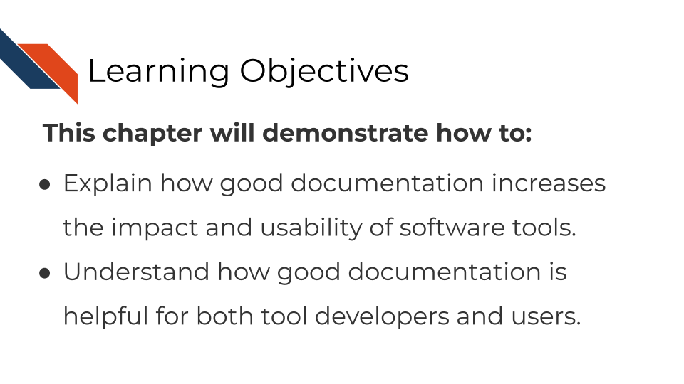
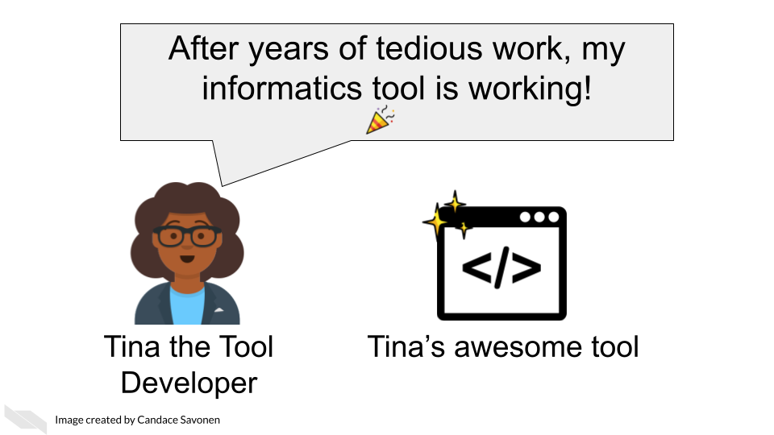
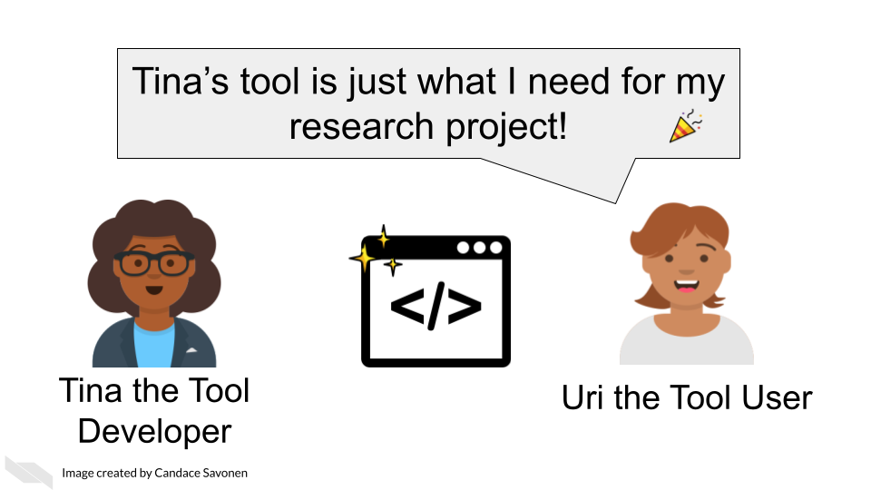
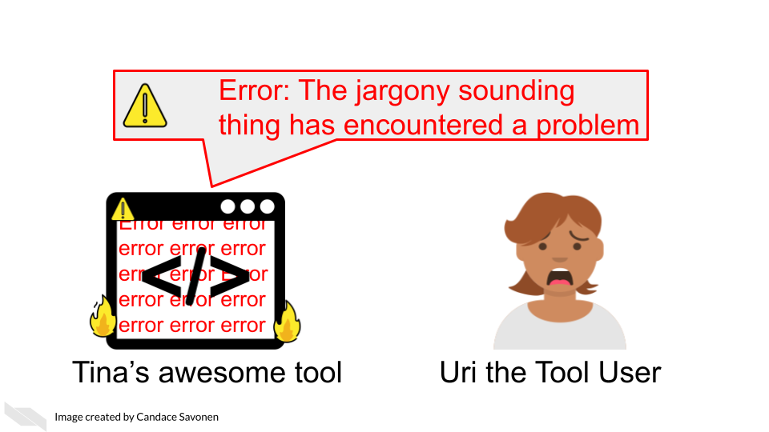
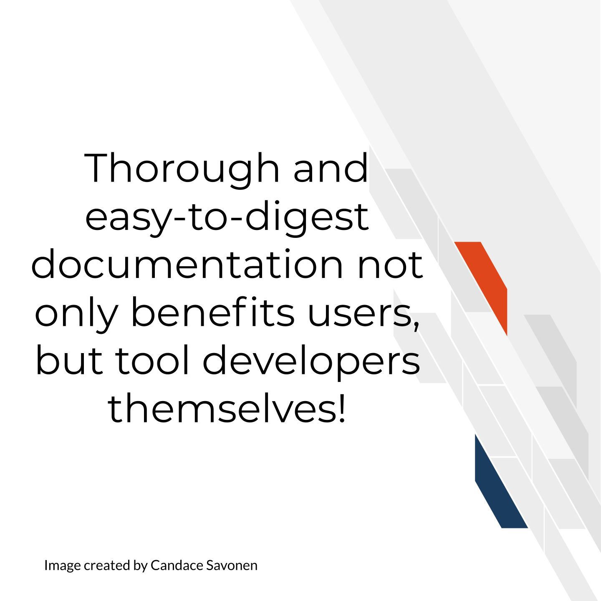
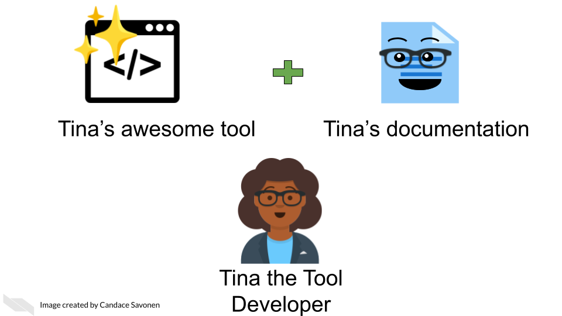
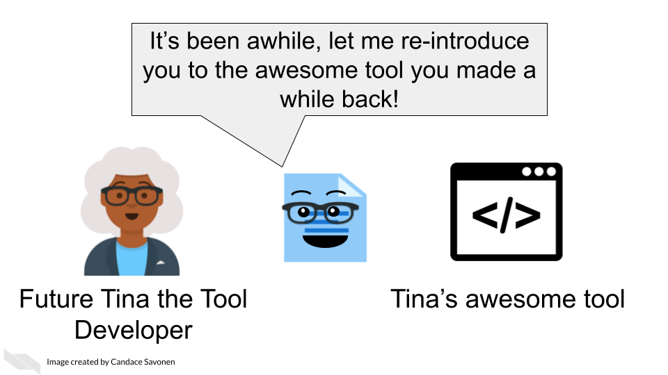

# Documentation: Why it's worth the effort!

## The context of bioinformatics tool development

Tool development is an exciting but long process -- filled with lots of careful programming, tedious troubleshooting, but also 'Aha' moments that ultimately can result in an amazing product that you should be proud of!

Tina the Tool developer, perhaps like you, has just gotten her product working well and many of the bugs have been sorted out. Tina's awesome tool is working exactly as designed and Tina is excited to get her tool out there to be used by the community!

^[For all cartoons:     
Avataars by https://getavataaars.com/.   
Icons by https://thenounproject.com/ License CC BY-NC-ND 2.0.     
Emojis by OpenMoji License: CC BY-SA 4.0.]

This is indeed cause for celebration! Perhaps researchers like Uri the Tool User will come across Tina's awesome tool and share in Tina's enthusiasm for the project! Tina's bioinformatics tool may be just what they were needing for their research project!

Uri the Tool User can't wait to apply Tina's awesome tool to their project! But, it may not be long before Uri encounters errors, or questions about Tina's awesome tool, no matter how high quality Tina's programming of the tool is.

Often users like Uri, particularly in the biology and cancer fields, have little to no programming experience. Even if a user does have programming experience, they are still unfamiliar with how Tina has set up tool. The tool may even be working exactly according to Tina's vision but if users like Uri do not understand Tina's vision or basic programming principles that Tina might take for granted, it can lead to a lot of frustration and time inefficiently spent.

If the tool's documentation is non-existent, scarce, out-of-date, or filled with too much jargon, the chances that Uri will be able to successfully and efficiently create a product with the tool is drastically diminished.

Lack of usability often leads users to ditch even the most well-programmed of tools.

This is the unfortunate and all-too-common result of many bioinformatics tools.

## Bioinformatics and usability

The lack of focus and education on usability in the bioinformatics tool development is not only a disservice to progress of cancer research, but also to the tool developers themselves who have equally spent uncountable work hours and effort on the development of cancer tools.

We know that bioinformatics tool development doesn't occur in a vaccuum. User designers in the field of bioinformatics have commented on reasons why documentation and usability sometimes suffer for bioinformatics tools:

- Problem 1) Tools developed in academia are often left to deprecate after publication because novelty is often prioritized over long-term maintenance and usability [@Mangul2019].
- Problem 2) Bioinformatics tool development teams generally don't have the resources to hire user-centered design experts and the small and specialized user communities are often overbooked and not incentivized to give feedback [@Pavelin2012].  
- Problem 3) There is a lack of resources/education about usability specific to bioinformatics tool developing communities [@Pavelin2012].   

Unfortunately this specific course cannot address issues 1 and 2, but will attempt to help with problem 3.

## Why documentation is worth the time

We realize many tool developers feel unenthused about the process of creating documentation. The documentation process requires a different skill set from the tool development itself; meaning many developers were likely not attracted to tool development because of documentation and may not be sure how to craft good documentation [@Wolf2016]. They may know its good for their tool, but they just aren't enthused about it.

We'd like to assure you that the effort for creating documentation has a high return payoff for the continued success of your tool as a whole!

Returning to our cast of characters, let's say that Tina the Tool Developer, had the time and knowledge to create awesome documentation for her tool.

Uri the tool User is still likely to encounter errors and problems, but with thorough and easy-to-digest documentation, Uri is better equipped to troubleshoot these problems! They may also learn more about the features and limitations of the tool that will better guide Uri's next steps!

Being equipped with user-centered documentation, Uri is more likely to be able to reach the next steps of their research and potentially share a publishable result! Tina's tool is now more likely to be cited in publications, or other forms of media.

This rewards Uri for having used Tina's tool, making Uri not only likely to continue to use the tool for their next projects, but Uri may also help spread the word about how great their experience with Tina's tool was.

This means that Tina may have a larger user base for her tool and will help Tina with future funding opportunities and making connections that will help her create more awesome tools!

Well-documented tools help developers better maintain their code in the future because they may forget the mechanics of their tool over time. If future Tina has to divert her time and effort to another project but then returns to do tool maintenance, documentation may help jog her memory!

Thorough and easy-to-digest documentation may also help other tool developers contribute features or fix bugs in Tina's tool. Here Colin the Contributor was able to read Tina's awesome documentation. It not only got him excited about the tool, but allowed him to program a new feature which he sent to Tina.

Now that you are hopefully energized and ready for creating documentation for your tool, let's talk about a bit user-centered design concepts!
