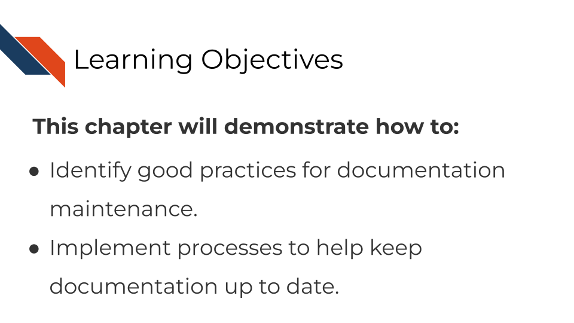
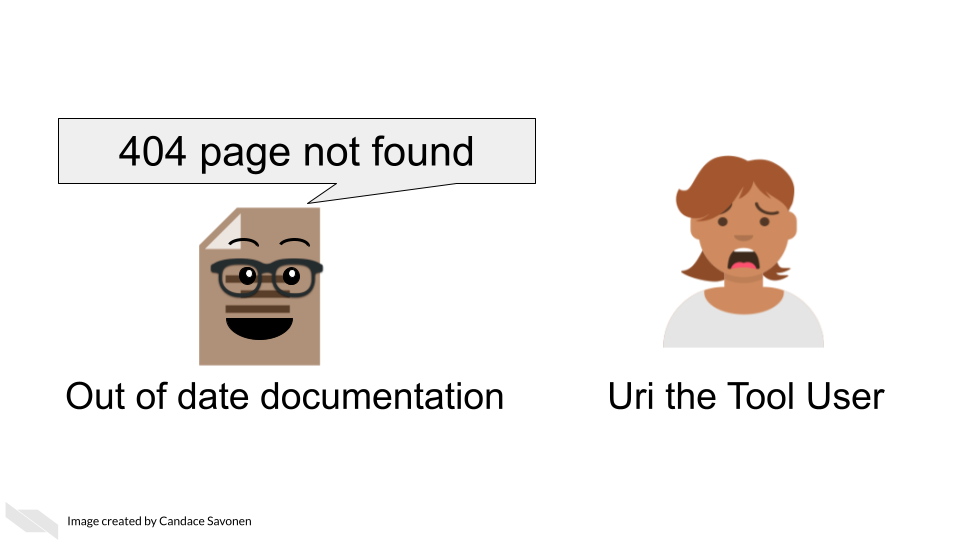

# How to keep your documentation up to date

## The goal of documentation maintenance

Perhaps you’ve been making improvements or otherwise updating your software tool. That's excellent and you deserve a big kudos for continuing maintenance on your tool!

But your work is not done yet. For each (user-facing) update you make to the tool, you should also make a documentation update. As a user, the only thing worse than having a tool with no documentation at all is having a tool with documentation that is out of date or otherwise incorrect.

If documentation updates aren't prioritized, your tool can easily get several versions ahead leaving the documentation you carefully crafted rather useless and misleading.

## Keep your documentation in one, version-controlled place

Presumably you have some sort of process for version controlling your tool updates (we assume GitHub but could be other services). Ideally, your documentation should be version controlled similarly and, if appropriate, in the same place.
The easier you make it on yourself to update your documentation, the more likely future you will be at updating it successfully! It's worth spending time thinking about your own development process and how you can make it easier on yourself and your team for longer-term better maintained documentation.

## Do not consider a tool fix done before its relevant documentation update is also completed

However you track your tasks, also track your documentation issues and always pair a software fix with a documentation fix -- or at least check if it affects anything user-facing. To help you remind you of this, you may want to use an [issue template](https://docs.github.com/en/communities/using-templates-to-encourage-useful-issues-and-pull-requests/configuring-issue-templates-for-your-repository) (if you use GitHub) and make sure that issue template includes a reminder to update documentation.

## Make sure links work

A very simple but all too common problem with out of date documentation is broken links!

You can catch these broken links by manually clicking on all your links, but sometimes broken links will still slip through the cracks anyway! There are GitHub actions and other automated tools that can check your URLs for you. Take advantage of automation to do this for you so you can save your time an effort for other improvements to your tool and documentation!

Here's some options for automated URL-checking:  

- [GitHub action: urlchecker-action](https://github.com/marketplace/actions/urlchecker-action).  
- [GitHub action: URL checker](https://github.com/marketplace/actions/url-checker).  
- [6 Tools to Find Broken Links on Your Website](https://www.outlookstudios.com/tools-to-find-broken-links-on-your-website/) [@OutlookStudios2020].  

## Exercise 1: Add a reminder for documentation updates to your task manager

- If you use GitHub, add an [issue template](https://docs.github.com/en/communities/using-templates-to-encourage-useful-issues-and-pull-requests/configuring-issue-templates-for-your-repository) that has a reminder to update documentation.  
- If you use something else for task management, look for some other way to remind yourself (and your fellow developers on the project) to keep documentation up-to-date for each change.

## Exercise 2: Implement a URL checker

- If you use GitHub for your documentation, add a url checking GitHub action to your repository.
We used a url-checker GitHub action for developing this course!
You can see [ours here for an example](https://github.com/jhudsl/ITCR_Documentation_and_Usability/blob/main/.github/workflows/url-checker.yml).  
- If you use something else for version control, look into URL checkers that you can easily implement into your development process.  
  
