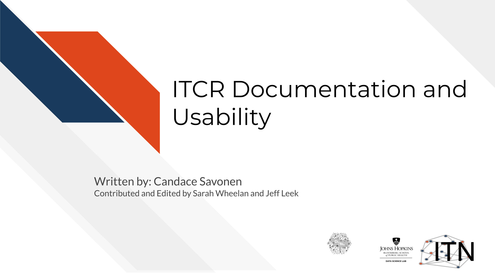
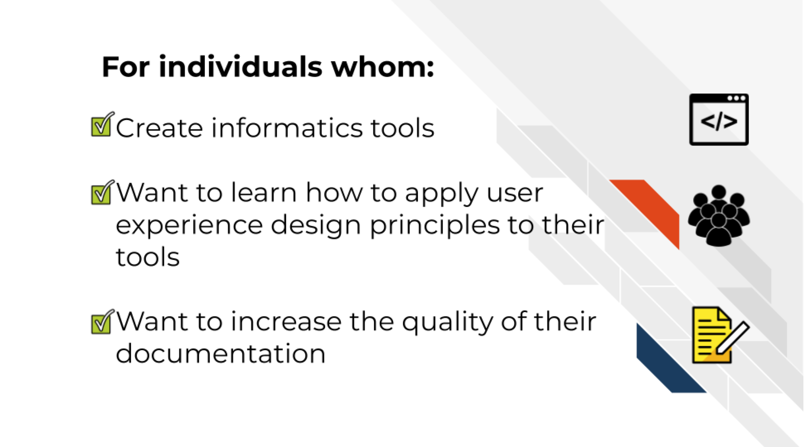
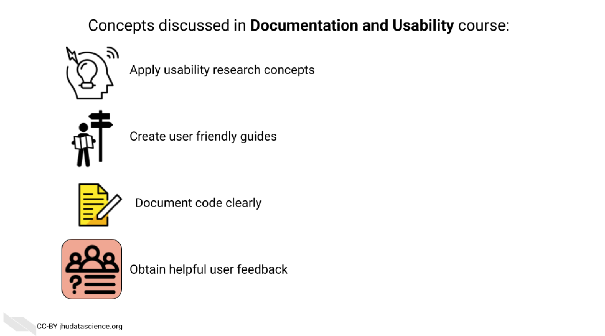

# Introduction

## Motivation

Cancer datasets are plentiful, complicated, and hold information that may be critical for the next research advancements. In order to use these data to their full potential, researchers are dependent on the specialized data tools that are continually being published and developed. Bioinformatics tools can often be unfriendly to their users, who often have little to no background in programming [@Bolchini2008]. The usability and quality of the documentation of a tool can be a major factor in how efficiently a researcher is able to obtain useful findings for the next steps of their research.

Increasing the usability and quality of documentation for a tool is not only helpful for the researcher users, but also for the developers themselves -- the many hours of work put into the product will have a higher impact if the tool is usable by the target user community. 70% of bioinformatics tools surveyed by @Duck2016 were not reused beyond their introductory publication. Even the most well-programmed tool will be overlooked by the user community if there is little to no user-friendly documentation or if they were not designed with the user in mind.

## Target Audience  

The course is intended for cancer informatics tool developers, particularly those creating tools as a part of the [Informatics Technology Cancer Research](https://itcr.cancer.gov/informatics-tools).

## Topics covered:

## Curriculum    

The course includes a hands-on exercises with templates for building documentation and tutorials for cancer informatics tools.
Individuals who take this course are encouraged to use these templates as they follow along with the course material to help increase the usability of their informatics tool.
