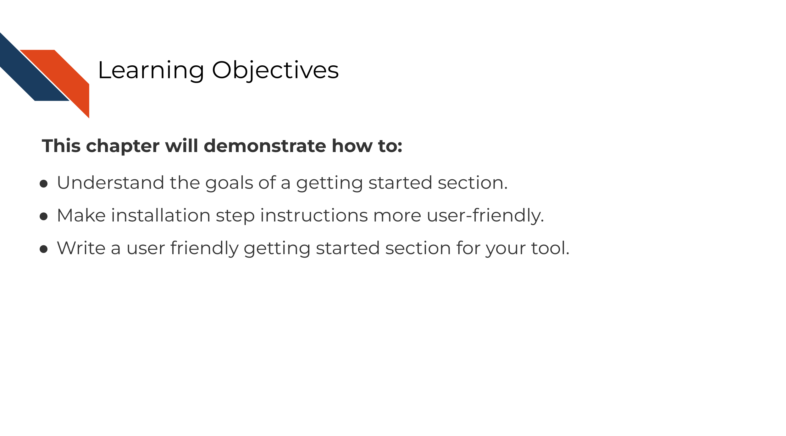
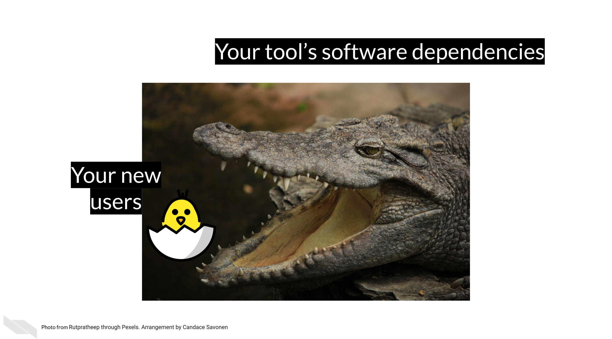
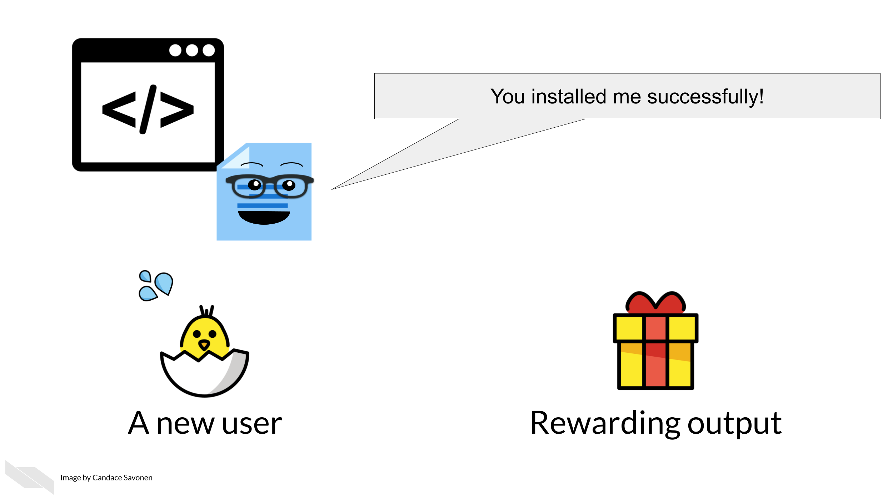

# Creating a smooth getting started section

## The goal of a getting started section

A getting started section is new users' first experience with your tool. It is also can be the most frustrating experience for your user if installation doesn't happen smoothly.

^[For all cartoons:     
Avataars by https://getavataaars.com/.   
Icons by https://thenounproject.com/ License CC BY-NC-ND 2.0.     
Emojis by OpenMoji License: CC BY-SA 4.0.]

Our goal for our getting started section is to guide our new users through the installation steps as quickly and smoothly as possible then send them to a brief tutorial to show off the awesomeness of your tool!

## Aspects of a smooth getting started section

### Easy to find!

It's hard to get started if you don't know where to begin! Your getting started section should be the easiest page to find. Have your link to your getting started page prominently feature on your landing page. If you have a navigation bar, include a link to your getting started page.

### Introduce your user to the basics

Provide users with the introductory concepts of the tool; briefly expand a bit more on `The Why` about your tool they already saw.

- In what context would someone be using your tool?
- What scientific questions or other needs might this tool assist with?

If your users' needs fit your description, this will fuel them with the motivation to get through the first big hurdle: installation.

Before getting to the install steps, a special consideration: Does your tool have multiple ways to run it, for example can it be ran either through a GUI or command line? Describe this to your users so they get shuttled to the method of running your tool that is right for them.

### Installation steps: the first big hurdle

Installation is the first and perhaps biggest hurdle your user will encounter with your tool. The **clearer and more specific these steps the better**. @Mangul2019b found that tools that required more installation steps (but didn't describe these steps adequately) were less likely to be installed successfully, and tools that were less likely to be installed successfully had significantly less citations!

If installation happens through command line, provide **copy-and-paste or directly runnable commands** that your user can use as-is.
In these commands, if parts of it need to be tailored, call attention where the tailoring needs to happen and how your user can determine what they need to put there.
Fill-in-the-blank cues can be handy for these scenarios.

**Tell your users what to expect**.
Do some steps take more time than others? Warn them about that. Are there output prompts that may not be intuitive but are to be expected? For example, sometimes a regular red text installation message may indicate things are working fine, but if a user doesn't know what the text means, sometimes they will try to interpret red text as meaning something bad has occurred.

Where it makes sense, you **use screenshots as assurances** to the user that they are on the right track. Being able to see that your users' screen matches what is shown in your screenshots reassures them that things are progressing correctly. Conversely, if something does not match, it can help them narrow in on a problem. _Keep in mind out-of-date screenshots can add to the confusion! -- more on tips about how to keep things up to date in a later chapter._

Install steps should also try to address any common pitfalls, particularly **how different operating systems might require different steps**. You may consider having separate sections or pages to describe install steps on different operating systems.

What dependencies does installing your tool require? Will these be installed automatically by the steps you describe or **does your user need to install other software** before being able to install your tool? This can be a big roadblock to users if dependencies and how to install them are not addressed.

**To recap:**  

Installation steps can be tricky -- and admittedly hard to give guidance on when individual computer' set ups can differ so much, but the more you are able to workshop your guidance to your users here, the more they will appreciate it and stick with your tool!

### Cover the basics

Your getting started section should give your users the basic concepts they need for running your tool -- a knowledge foundation that they can build upon as they continue to explore and follow your how-to examples.

- What basic terms should your users know?
- What do your users need to get started - what kind of data?

Because you know all the ins and outs of your tool, you may be tempted to discuss the intricacies of your tool as you are writing the getting started information, but try to stick to ["just in time"](https://en.wikipedia.org/wiki/Just-in-time_learning) information -- only bring up concepts exactly when your users will need them, not before. Users will almost always feel more information-overload than you suspect.

### Reward your user with a short tutorial!

Installation steps are not fun so the later part of your getting started section should lead your user into a quick tutorial that will reward your user for making it through the hard part!

Give your users the fewest steps needed to produce a rewarding result that will excite them about continuing to use your tool! Use this opportunity to show off your the simplicity and awesomeness of your tool!

This rewarding result might be a cool visual or a plot -- but also should demonstrate the most popular thing your users would like to see.

### Directs the user to the how-to examples section

Now that your user has successfully installed your tool and understands the basic idea, let them know where they can find more examples to keep the learning train going! Have a link at the end of your getting started section that sends them to a place they can browse your how-to examples (which we will discuss in the next section!).

## Good examples of getting started sections

[Snakemake has a great getting started section](https://snakemake.readthedocs.io/en/stable/getting_started/installation.html) [@Molder2021]. The makers of Snakemake tell their users how to install Snakemake using different situations and keeping dependencies in mind, right after which they have a short tutorial to entice their users!

[GSEA](https://www.gsea-msigdb.org/gsea/doc/GSEAUserGuideFrame.html) introduces their users to multiple options of how they can run the tool and nicely use reassuring screenshots throughout to let their users know if they are on the right track [@Subramanian2005]!

## Exercise: Create your own getting started section!

Use [the template getting started document](https://raw.githubusercontent.com/jhudsl/template-documentation/master/docs/getting_started_template.md) to start your own getting started section either by using the markdown template directly, or navigating to the MkDocs repository (or other set of documentation) you set up in the previous chapter.
