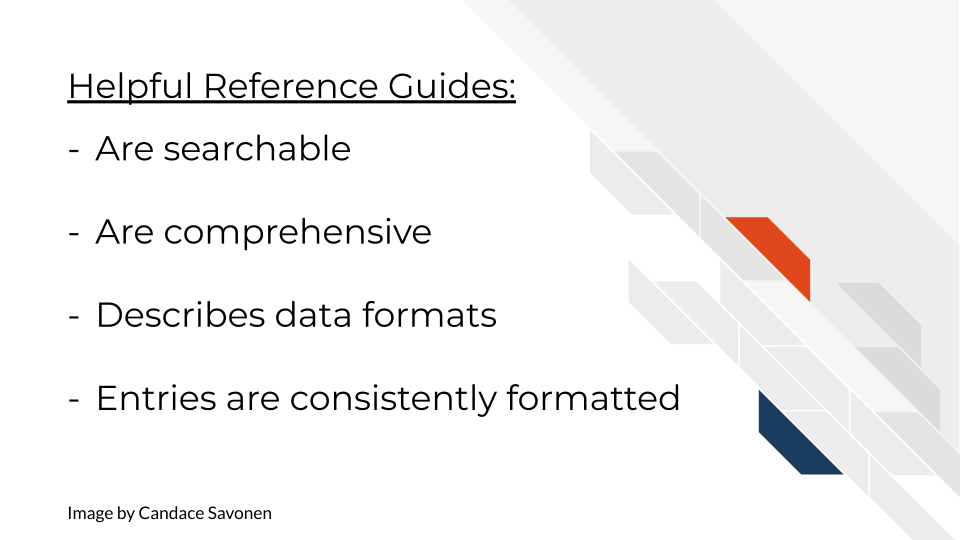

# Creating handy reference guides

## The goal of a reference guide

Reference guides are the dictionary of your tool: they aren't meant to be read front to back, but the best ones are easily searchable. Your user will have something in mind that they are trying to find information on -- the quicker they can find it, the quicker their question can be answered.

^[For all cartoons:     
Avataars by https://getavataaars.com/.   
Icons by https://thenounproject.com/ License CC BY-NC-ND 2.0.     
Emojis by OpenMoji License: CC BY-SA 4.0.]

Our goal for a reference guide is to be as comprehensive, navigable, and as always, as _clear_ as possible.

## Characteristics of handy reference guides

### Is easy to find

As with our other documentation sections, no matter how well they are crafted, they are of no use if no one can find them. Make sure that a link to the reference guide is clear to find in a navigation bar and/or the main page.

If the reference guide is a part of a command line package, make sure that it is clear in your documentation what command you need to see it (e.g. `--help`).

### Is searchable

Users will be digging into your reference guide looking for a specific entry. Making your reference guide alphabetical is a start. If you are able to make terms searchable that's even better, but at the very least, if your reference guide is visually easy to be scan, that can serve a similar function.

### Is comprehensive

All items are covered in the reference guide -- every. single. thing.
This includes all:

- Terms
- Functions
- Arguments
- Parameters
- Defaults
- Datasets or items included in the package
- Buttons (in the case of a GUI)

**The most useful entries in these reference guides...**  

- Not only define the item, but tell how it relates to other items (and they have links where relevant).
- Discuss all the possible inputs that can be used as well as how to decide which input fits the user's needs.
- Make any existing defaults very clear.
- Shows the usage of that item in context -- some example lines of code go a long way.
- Tries to avoid the use of jargon, but if it is absolutely necessary to use a jargon-y term it links to information about the meaning of the term.

Take a look at [DESeq2's reference guide](https://bioconductor.org/packages/release/bioc/manuals/DESeq2/man/DESeq2.pdf), @Love2014 do a great job at their entries -- covering the right amounts of information and informing the user about how to decide what works for them.

### Data formats are described

Perhaps after installation, getting data formatted correctly is one of the other very large hurdles users will need to deal with.

Ideally, your tool can use a data format that is common. But the more that your tool is particular about an odd data format, the more your documentation needs to be specific about what the odd data format looks like.

- Include example files for a positive control/example.
- Send your user to any tools they can use to convert their data format automatically.
- If its feasible, include an automatic data converter as a part of your tool.

[GSEA has great descriptions of their data formats](https://www.gsea-msigdb.org/gsea/doc/GSEAUserGuideTEXT.htm#_Loading_Data) with examples of what the data formats look like.

### Entries should have a consistent format

Consistency helps your users know what to expect and know where to find information! Each entry in the reference guide should have the same format and sections, in the same order.

Depending on the destination of your package, a consistent format may already be determined for you. Bioconductor packages have [specific guidance on these reference manuals](http://cran.fhcrc.org/doc/manuals/R-exts.html#Documenting-functions).

**To recap:**

## Good examples of reference guides

[QIIME2 has a great reference guide](https://docs.qiime2.org/2021.2/glossary/)! @Bolyen2019 cover all items and terms with lots of links to more information or related entries.

[Bioconductor packages](https://bioconductor.org/packages/3.12/bioc/) have a consistent reference guide format that the packages there adhere to which makes it easier for users to find what they are looking for once they are familiar with the format. A typical package's reference guide [looks like this](https://bioconductor.org/packages/3.12/bioc/manuals/GenomicRanges/man/GenomicRanges.pdf).

## Exercise: Create your own reference guide!

_For R package documentation:_
Follow the advice from Hadley Wickham from the [R Packages book](https://r-pkgs.org/man.html) which includes using [roxygen2 package](https://cran.r-project.org/web/packages/roxygen2/vignettes/roxygen2.html) to automatically render those .Rd files!

If your tool's destination is Bioconductor, see their specific guidance on [manual pages](https://bioconductor.org/developers/package-guidelines/#manpages).

_For Python package documentation:_
Follow the `docstrings` guidance and instructions [here](https://realpython.com/documenting-python-code/).

For other general purposes, you can our [the reference guide template](https://raw.githubusercontent.com/jhudsl/template-documentation/master/docs/reference_guide_template.md) to start your own reference guide either by using the markdown template directly, or navigating to the MkDocs repository you set up in the previous chapter.
